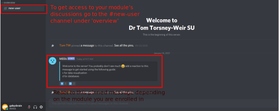
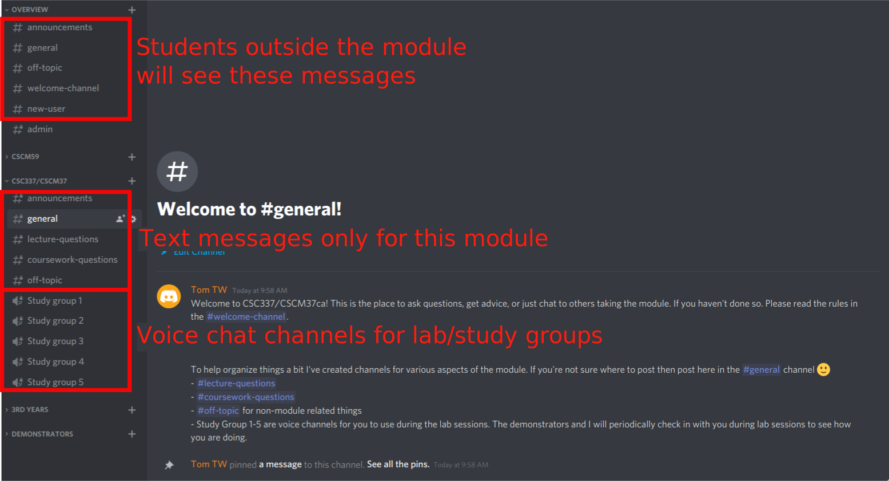

In this module we'll be using [Discord](https://discord.com/) for help and
general communication. I tried using Zoom in the past and had issues.
If you're not familiar with Discord, it's a messaging service that's always
running. It also has voice channels which also support video and screen
sharing. Both myself and the demonstrators will be monitoring the channels and
will try to answer questions there. However, don't expect us to be online all
the time, especially outside normal office hours. Please feel free to answer
each other's questions and support each other! 

*As a rule I will not respond to private messages in discord.* If you have a
question, please use the public channels to ask. Likely, other people will also
have the same question!

If you want to discuss something with me privately you can always email me at
t.d.torsney-weir@swansea.ac.uk or attend my office hours on zoom.

## Installation/setup

You can access Discord through a browser or download the client. Either way,
head over to <https://discord.com/> and sign up for an account if you don't have
one already. Once you've done that, you can join my server by using this 
link: <https://discord.gg/3SeeXdFYwU>. Once you've done that, please go to 
the #new-user channel and add a 'v' reaction to be part of the module.

## Text channels

Discord has text and voice channels. The text channels are nice for asking 
and answering questions as they come up. If you post in the overview category,
these will go to all students that are on my server, not just those in 
CSC337/CSCM37.

To help organize things a bit I've created channels for various aspects of the
module. If you're not sure where to post then post here in the #general channel
:)

- #lecture-questions
- #coursework-questions 
- #off-topic for non-module related things

## Voice channels

This is a really nice feature of discord where you can join a voice channel but
not lose context with the rest of the discussion. I made several of these voice 
channels which hopefully will be enough. If you click on one of these headings
you will automatically join the voice chat.

The idea is that you can form small groups during to help each other out and
discuss problems with each other. The demonstrators and I will move through
these sessions during the labs to see if you need any help. 

I want to be clear that **solutions must be your own**! The best way to handle
this is to ask questions of each other but write the code yourself. I will 
forward anything that seems like plagarism to the plagarism people.

You can also use these channels outside the lab time if you want.

